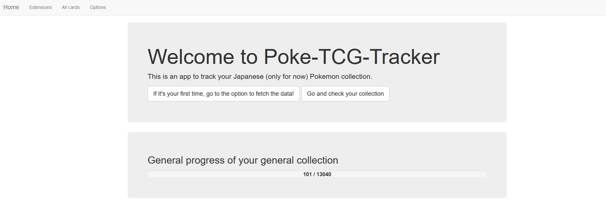
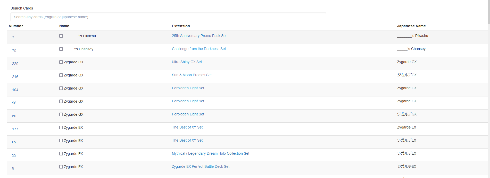
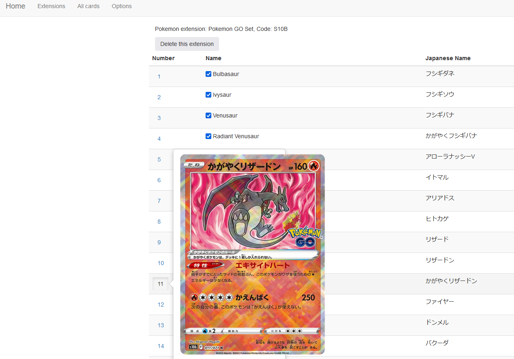
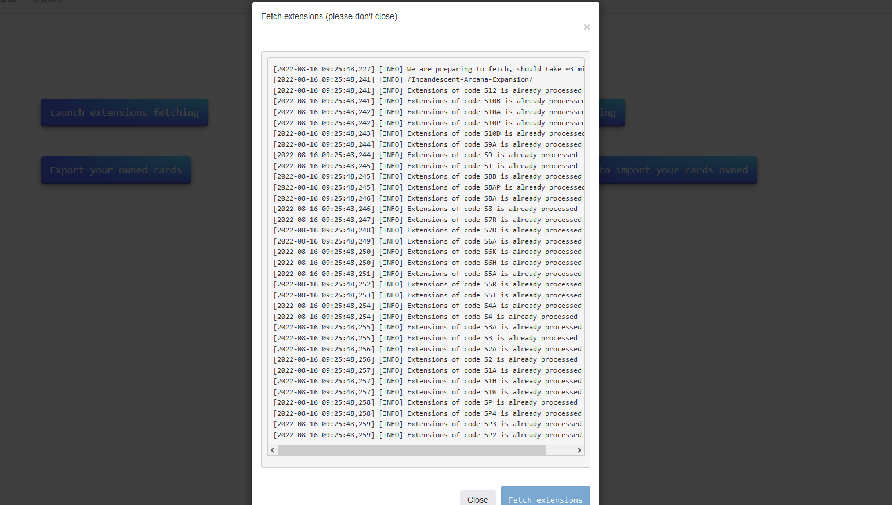

# Pokemon-tcg Tracker

This project's goal is to be able to track your japanese Pokemon card collection. It was done mostly for fun and learn a full stack deployment project.

It is written fully in Python3.9 with Flask-bootstrap, and deployed with docker-compose.

The database is [Clikhouse](https://clickhouse.com/), and there is an ngninx for the fun.

###On a first run, the cards info fetching might take at least 1 hour sadly, due to the nature and the number of cards.
### I Might include a dump of the already processed DB to avoid this problem

### Data

**DISCLAIMER**: I don't own any of the data used in the project, all the images are taken from [Pokellector](https://www.pokellector.com/) and all the data around 
extensions and cards are also taken from there.

This projects merely scraps the data from the website to be able to have content to display.

### Functionalities

- Tracking per extension of Pokemon cards
- One button to update new extensions coming out
- Card Search with thumbnails
- Extension Search
- Extension Deletion (in case of bug/problem)
- Full extension completion / unselection  
- Export of collection
- Import of collection

### Screenshots
#### Home screen

#### Card list page

#### Extension tracking with thumbnails

#### One button additional data fetching

### Licensing and contributions
All contributions are welcome, both as questions, constructive criticism, feature requests and of course pull requests.

This project was mostly done for fun, so don't be upset if i'm not updating it.

This project SHOULD NOT BE COMMERCIALIZED.